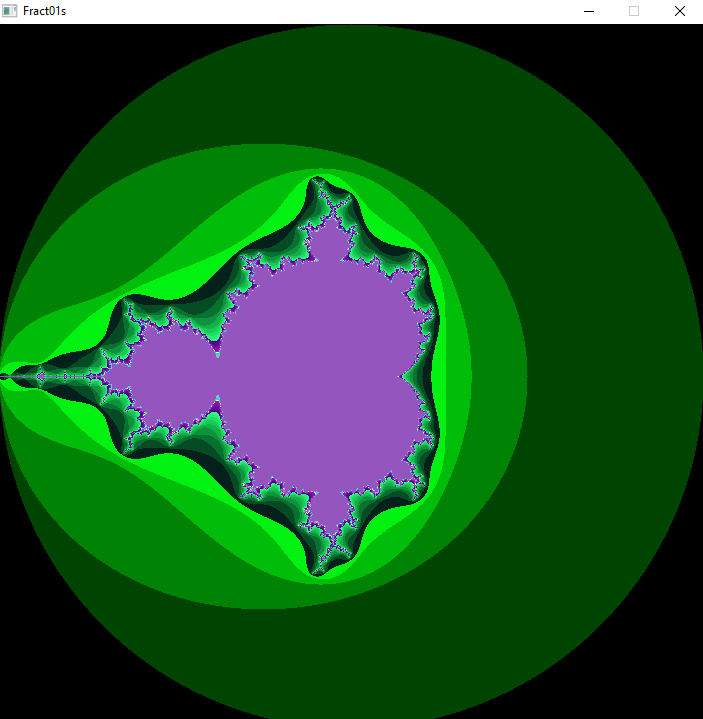

# Fract01s
Project based on old school project Fractol I did as part of graphics branch in HIVE.
The aim is to take old C code and find ways to improve it, move it to C++, use C++ features etc, port it to SDL3 etc.

# Controls
1. Click & Drag OR Arrow keys - Move around.
2. Scroll Wheel - Zoom to spesific location.
3. 1-0 - Number of iterations aka more defined fractals. 0 represents 10. Key value is multiplied by 10.
4. Numpad -/+ - Add/decrease iterations by 1.
5. R - Reset to original position.
6. C - Change colour.
7. F - Change fractal.
8. ESC - Exit.
